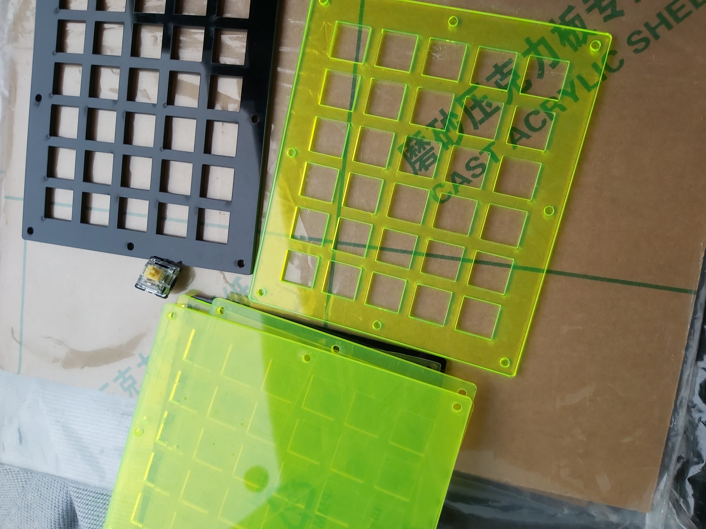
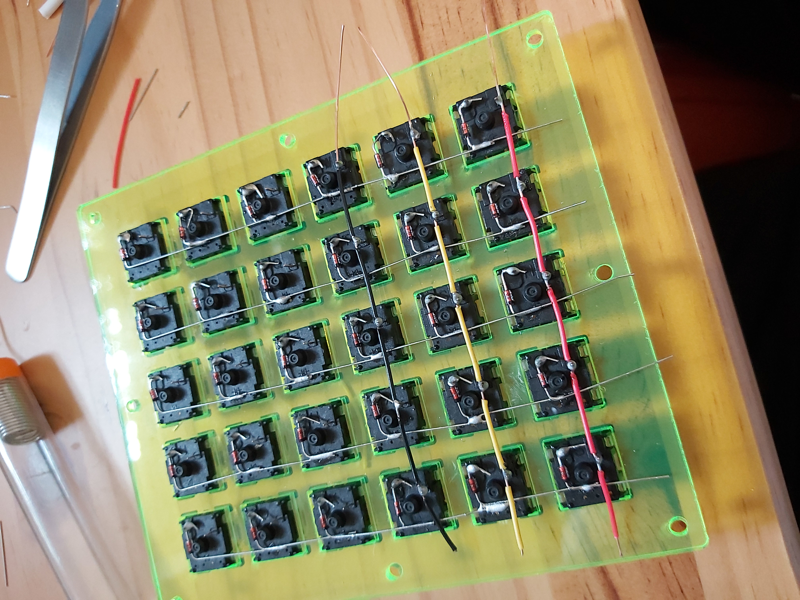
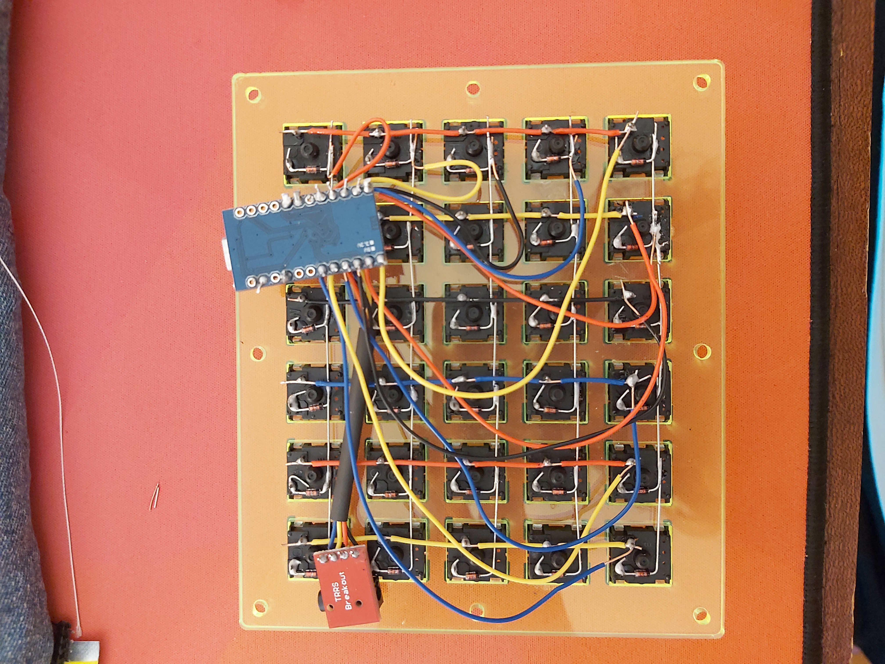
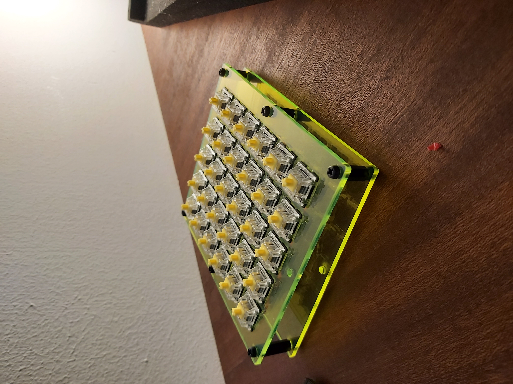
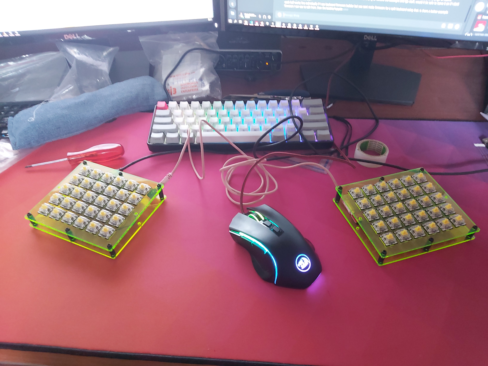

## 1. Table of Contents

- [1. Table of Contents](#1-table-of-contents)
- [2. Form Factor Research](#2-form-factor-research)
  - [2.1. 75% ortho](#21-75-ortho)
  - [2.2. planck](#22-planck)
  - [2.3. DIY kit option (KBDFans NIU Mini)](#23-diy-kit-option-kbdfans-niu-mini)
  - [2.4. Split ortho 75%](#24-split-ortho-75)
    - [2.4.1. ideas](#241-ideas)
  - [2.5. iris (mini ergodox also 40%)](#25-iris-mini-ergodox-also-40)
  - [2.6. split 40%](#26-split-40)
    - [2.6.1. ideas](#261-ideas)
- [3. Final Choice](#3-final-choice)
- [4. Componenents](#4-componenents)
  - [4.1. Case and Plate](#41-case-and-plate)
  - [4.2. BOM](#42-bom)
  - [4.3. Cost](#43-cost)
- [5. Ciruit Diagrams](#5-ciruit-diagrams)
- [6. Build Log](#6-build-log)
  - [6.1. hot glue](#61-hot-glue)
  - [6.2. communication between the two halves](#62-communication-between-the-two-halves)
  - [6.3. firmware](#63-firmware)
  - [6.4. Adding VIA support](#64-adding-via-support)
- [7. Final Thoughts/Review](#7-final-thoughtsreview)
  - [7.1. Problems that arose](#71-problems-that-arose)
  - [7.2. improvements for future](#72-improvements-for-future)
- [8. Some Photos](#8-some-photos)
- [9. References](#9-references)
  - [9.1. Useful links](#91-useful-links)
  - [9.2. handwired qmk guide](#92-handwired-qmk-guide)
  - [9.3. Links that were useful during the build](#93-links-that-were-useful-during-the-build)

## 2. Form Factor Research

Before I started on my journey, I had to do some research on just what type of keyboard I would like to build.
I had three main criteria:

1. size: I had grown fond of the compact sizes on r/mechanicalkeyboards and would like to keep the board as smal as would still be practical
2. cost: I did not want my first foray into mechanical keyboards to cost me a fortune as I would just be trying it out.
3. cool factor: I didn't want it to just be any old keyboard.

With that in mind here are the options I considered with pros and cons.
I also inclued KLE json for each of them for convenience sake.

### 2.1. 75% ortho


pros:
- fits in 60% case
- dedicated number row
- space for 2x2u keys on bottom row (shift and space)

cons:
- larger than 40% (same size as 60%)
- number row on ortholinear might be weird
- more switches

```json
["~","1","2","3","4","5","6","7","8","9","0","-","="],
["Tab","Q","W","E","R","T","Y","U","I","O","P","Back Space","home"],
["Esc","A","S","D","F","G","H","J","K","L",";","'","end"],
["Shift","Z","X","C","V","B","N","M",",",".","/","Return","delete"],
["meme","Ctrl","Alt","Super","&dArr;","sp1","sp2","&uArr;","&larr;","&darr;","&uarr;","&rarr;","fn"]
```

### 2.2. planck


pros:
- relatively standardised layout
- really small
- looks cool

cons:
- really small
- will have to build own case

```json
[{a:7},"Tab","Q","W","E","R","T","Y","U","I","O","P","Back Space"],
["Esc","A","S","D","F","G","H","J","K","L",";","'"],
["Shift","Z","X","C","V","B","N","M",",",".","/","Return"],
["","Ctrl","Alt","Super","&dArr;",{w:2},"","&uArr;","&larr;","&darr;","&uarr;","&rarr;"]
```

### 2.3. DIY kit option (KBDFans NIU Mini)

[kbdfans niu mini diy kit](https://kbdfans.com/products/niu-mini-40-diy-kit)


pros:
- easier build
- nicer case than I could make

cons:
- expensive

### 2.4. Split ortho 75%


[guide](https://www.thingiverse.com/thing:4565609)

pros:
- split (ergo)
- ortho means easier diy/plate

cons:
- have to build own case
- needs two pro micros and trs connectors (more parts)
- more switches = more money

#### 2.4.1. ideas

wood case
acrylic plates
hand wired

### 2.5. iris (mini ergodox also 40%)


[link to a build guide](https://jonathanbayless.com/2020/06/09/iris-handwire.html)

pros:
- ergonomics
- less switches = cheaper (more than a 40% though)
- looks **really** cool
- case has an interesting shape

cons:
- 2 pro micros and trs needed
- will have to build own case
- quite involved build process
- slightly bigger case

### 2.6. split 40%


[a very thorough build guide](https://johannes-jansson.github.io/projects/2018/07/23/hand-wiring-lets-split.html)

pros:
- ergonomics
- less switches = cheaper
- looks really cool

cons:
- 2 pro micros and trs needed
- will have to build own case
- more involved build process

```json
["Tab","Q","W","E","R","T",{x:1},"Y","U","I","O","P","Back Space"],
["Esc","A","S","D","F","G",{x:1},"H","J","K","L",";","'"],
["Shift","Z","X","C","V","B",{x:1},"N","M",",",".","/","Return"],
["","Ctrl","Alt","Super","&dArr;","",{x:1},"","&uArr;","&larr;","&darr;","&uarr;","&rarr;"]
```

#### 2.6.1. ideas

acrylic and standoffs for case (ie raspberry pi)

## 3. Final Choice

split 75% ortho handwired (similar to let's split only with a number row.) with an acrylic mounting and base plate separated by pcb standoffs.

```json
[{a:7},"~","1","2","3","4","5",{x:1},"6","7","8","9","0","Num Lock"],
["Tab","Q","W","E","R","T",{x:1},"Y","U","I","O","P","Back Space"],
["Esc","A","S","D","F","G",{x:1},"H","J","K","L",";","'"],
["Shift","Z","X","C","V","B",{x:1},"N","M",",",".","/","Return"],
["Fn","Ctrl","Alt","Super","&dArr;","Shift",{x:1},"Space","&uArr;","&larr;","&darr;","&uarr;","&rarr;"]
```

## 4. Componenents

### 4.1. Case and Plate

The case and plate where generated using [swillkb builder](builder.swillkb.com/)
I had the case and plate laser cut in 3mm acrylic by my uncle. who graciously didn't charge me.


### 4.2. BOM

- 4 x (134.301mm x 96.201mm x 3mm) acrylic sheets (2 will be lazer cut for mounting plates)
- 48 x gateron yellow switches [bangood is probably a safer bet even if its more expensive](https://www.banggood.com/)
- 48 1N4001 or 1N4148 silicon diodes [check this link](http://www.40percent.club/2016/07/diodes.html)
- 48 x DSA blank keycaps [Aliexpress is the cheapest](https://www.aliexpress.com/item/1005001453122923.html?spm=a2g0o.cart.0.0.70bf3c00m8bF9A&mp=1)
- 2 x arduino pro micro [banggood delivers quickest](https://www.banggood.com/Geekcreit-Pro-Micro-5V-16M-Mini-Leonardo-Microcontroller-Development-Board-Geekcreit-for-Arduino-products-that-work-with-official-Arduino-boards-p-1077675.html?rmmds=cart_middle_products&cur_warehouse=CN)
- 1 x trrs cable (salvaged from an aux cable my brother gave me)
- 2 x trrs breakout boards (bought off banggood)
- wire (cat5 cable that I salvaged wire from)
- pcb standoffs (banggood)

### 4.3. Cost

| Store                  | Cost      |
| ---------------------- | --------- |
| Bangood cart           | R1450     |
| Aliexpress (just caps) | R223      |
| **Total**              | **R1673** |

## 5. Ciruit Diagrams

[Keyboard Firmware Builder](https://builder.mrkeebs.com/) proved extremely helpful in working out the layout for this build.

## 6. Build Log

### 6.1. hot glue

After Installing the switches and soldering everything in place I realized the switches do not clip in properly to a 3mm plate (1.6mm is the required thickness from the switches datasheet) but a thinner acrylic plate would have way too much flex.
The issue this cause was that removingkeycaps would rip out the switch and undo all the hard work that went into soldering.
The only solution I could come up with was to hot glue everything in place from unmderneath.
I tried my best to be neat and keep the hotglue where the keycaps would cover it.

### 6.2. communication between the two halves

I opted for I2C over a TRRS cable.
This required me to solder 2 pull up 4k7 ohm resistors on the sda and scl lines (pin 2 and pin 3).
You can see a schematic below.


### 6.3. firmware

this is how I wired my rows and columns to the Pro-Micro

```txt
rows:  
0=b5
1=b4
2=e6
3=d7
4=c6

cols:
0=b6
1=b2
2=b3
3=b1
4=f7
5=f6
```

For the firmware I initially tried using the Nyquist firmware but ran into issues, I ended up using the Let's Split firmware in the handwire folder and adding a row and adjusting the layout.

These articles helped me to build/flash the pro micros.

1. [qmk building firmware](https://docs.qmk.fm/#/newbs_building_firmware)
2. [qmk lets split flashing](https://github.com/qmk/qmk_firmware/tree/master/keyboards/lets_split#flashing)

>NOTE:
>In order to flash the promicro you should begin flashing on the computer then bridge the GND and RST (ground and reset) pins on the pro micro (or press the reset swiitch if your board has one.)

You also have to flash both pro micros.

### 6.4. Adding VIA support

After a while I discovered the amazing VIA software and decided to try add support for my build.
I followed along with [this stream by mechmerlin](https://www.youtube.com/watch?v=KQCJmRKr13Y)

although following the documentation on [caniusevia.com](https://caniusevia.com/docs/specification/) also proved helpful

I ended up completely rewriting the qmk firmware and removed the ``rev1/`` and ``rev2/`` folders so the firmware is overall much simpler.

After flashing both promicros with this new firmware you should be able to import the ``via.json`` file into VIA and the board should be detected.

I have also included a much nicer via layout in the via folder on the [github repo for this project](https://github.com/plainoldcheese/lets-split-preonic-handwire)

## 7. Final Thoughts/Review

### 7.1. Problems that arose

The soldering went quite smoothly apart from the fact that my iron has a really short cable and I ended up using my left hand to solder which resulted in a few burns. I also may have melted the switch housings on a few of the switches when my iron was set too hot (I think I saw it suggested to use 325C and mine was set to 400C)

The firmware was more of a problem since my row and column pins were different than what would be on the nyquist PCB.
This meant that I could not use the online configurator and I had to figure out how qmk works.
I also didn't bother trying to get it all working on windows and just used my linux laptop to do all the programming and flashing.

All things considered It was quite smooth sailing and the keyboard was up and running in 2 days (4 hours assembly and the rest debugging).

My keycaps also got delayed in post so the keyboard sat on my desk for a few more weeks before I could fully test drive it.

### 7.2. improvements for future

for future builds I may opt for a pcb not because handwiring is difficult but because having the switches be pcb mounted would add to stability without the use of hot glue. the handwirted board looks kinda messy

I have seen cool stuff done using fr4 plates and bottoms this would allow the entire board to be made with the pcb. If I have the plates made using JLCPCB or something similar this could bring the cost down a bit compared to purchasing a pcb and having it shipped.

If I do not adapt to the split I may try my hand at building a plank as they are also a little more portable. If I do not adapt the ortholinear layout I may try a columnar stagger or regular stagger board again ([this compact "full" size board](https://www.reddit.com/r/MechanicalKeyboards/comments/ksto32/chocolate_bar/) has caught my attention).

## 8. Some Photos











## 9. References

### 9.1. Useful links

- [KLE for making layouts](http://www.keyboard-layout-editor.com/#/)
- [builder.swillkb for making svgs of mounting plates](http://builder.swillkb.com/)
- [Kailh box heavy pale blues on Banggood](https://www.banggood.com/70Pcs-Kailh-BOX-Heavy-Pale-Blue-Switch-Clicky-Keyboard-Switches-for-Keyboard-Customization-p-1435806.html?cur_warehouse=CN&rmmds=search)
- [Gateron yellows on Banggood](https://www.banggood.com/70PCS-Pack-3Pin-Gateron-Linear-Yellow-Switch-Keyboard-Switch-for-Mechanical-Gaming-Keyboard-p-1426530.html?rmmds=search&cur_warehouse=CN)
- [60% case on Banggood](https://www.banggood.com/DIY-60-pencent-Mechanical-Keyboard-Case-Universal-Customized-Plastic-Shell-Base-for-GH60-Poker2-p-1183414.html?rmmds=search&ID=3868&cur_warehouse=CN)

### 9.2. handwired qmk guide

- [qmk handwire build](https://docs.qmk.fm/#/hand_wire)
- [firmware builder](https://kbfirmware.com/), this will also make a wiring diagram
- [another build guide](https://68keys.io/)

### 9.3. Links that were useful during the build

- [roast potatoes wiring guide](https://blog.roastpotatoes.co/guide/2015/11/04/how-to-handwire-a-planck/)
- [qmk handwire guide](https://docs.qmk.fm/#/hand_wire)
- [sparkfun pin names for pro micro](https://learn.sparkfun.com/tutorials/pro-micro--fio-v3-hookup-guide/hardware-overview-pro-micro)
- [let's split qmk page](https://qmk.fm/keyboards/lets_split/)
